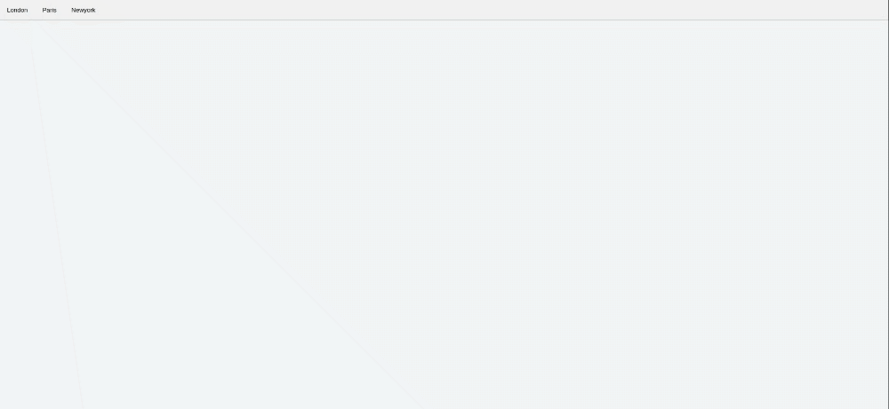
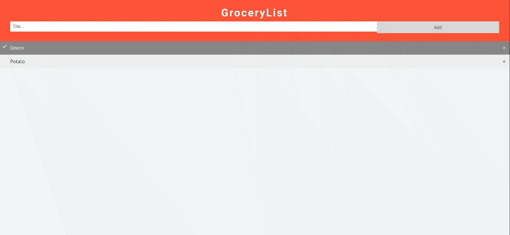

# POC Report
This Work is Assign When i am Working in OnGraph
<details>
<summary>How to Create a Modal</summary>

# How to create a Modal

#### Description
A modal (also called a modal window or lightbox) is a web page element that displays in front of and deactivates all other page content. To return to the main content, the user must engage with the modal by completing an action or by closing it. Modals are often used to direct users’ attention to an important action or piece of information on a website or application.

For example, consider an application 


#### Steps to Reproduce

1. Created Three Basic Ideas Button/Trigger, The Modal(or a Div) and The Modal Content(Containes Text and a Close Button)
2. Button -> One can use the simple tag and give it an id so that you can map the action using JS
```
<button></button>
```  
3. Modal -> a simple div tag one could use.
```
<div></div>
```
4. Inside Modal-> Two things We Need to cover foa a basic Modal Text(a <p> tag) and a close button(one can use span &times(x))
```
<div>
  <span>&times</span>
  <p>This is Modal Content</p>
</div>
```
5. Get All The Element part modal, btn, span by using <b>document.getElementById or document.getElementByClassName</b>
6. Listen for the Action like <em>Click</em> to change the CSS Property to <quote>block or None</quote> to get the modal Displaved or invisible.


#### Proof of conecpt

JS Concept uses:
1. document.getElementById
2. addEventListner

Attachments: 

1. 

#### Impact 
* This helps To instantly Get the attention Of User TO follow This Action Before Doing Anything Else.

</details>
<details>
<summary>How to Create a FAQ page</summary>

# How to create a FAQ page

#### Description
THis is Basically a Modal Collapse that is used to show and hide element. Buttons and Anchors are used as triggers that are mapped to a specific element you toggle.

For Example consider an application


#### Steps To Reproduce

1. Two Basic element needed to execute this is a button/trigger and <b>Div</b> That hold the Content
```
<button></button>
<div class = 'conten'>
This is Hidden in button
</div>
```    
2. Minimal amount of Css to design the Div and button on hover effect
3. Select the button by <b>document.getElementByClassName</b>  
4. Iterate over the particular col(button) so that at a time one gets only trigger at a time and other gets close
```
var coll = document.getElementsByClassName("collapsible");
var i;

for (i = 0; i < coll.length; i++) {
  coll[i].addEventListener("click", function() {
    this.classList.toggle("active");
    var content = this.nextElementSibling;
    if (content.style.display === "block") {
      content.style.display = "none";
    } else {
      content.style.display = "block";
    }
  });
}
```

#### Proof of conecpt
JS concept Uses:
1. addeventlistner

Attachments
1. 


#### Impact
</details>

<details>
<summary>How to create a Tab that Display Different Content</summary>

#### Description
  Tabbed navigation is a way to navigate around a website.
Normally, tabbed navigation uses navigation buttons (tabs) arranged together with the selected tab highlighted.
This example uses elements with the same class name ("city" in our example) , and changes the style between display:none and display:block to hide and display different content


#### Steps to Reproduce

1. To Create a Series of Tabs one need to decide how many tabs he needed in our case we are decided with three.
```
<div class = "tab">
<button></button>
<button></button>
<button></button>
</div>
``` 
2. And simultaneouslt Three content div to hold the content of it when it gets trigger
```
<div>
</div>
<div>
</div>
<div>
</div>

```

3. For Each Button Action We Had Mapped a <b>onClick</b> Event to each of the button and eery time one is click we replace its display type to "block" to "active"

```
function openCity(evt, cityName) {
  // Declare all variables
  var i, tabcontent, tablinks;

  // Get all elements with class="tabcontent" and hide them
  tabcontent = document.getElementsByClassName("tabcontent");
  for (i = 0; i < tabcontent.length; i++) {
    tabcontent[i].style.display = "none";
  }

  // Get all elements with class="tablinks" and remove the class "active"
  tablinks = document.getElementsByClassName("tablinks");
  for (i = 0; i < tablinks.length; i++) {
    tablinks[i].className = tablinks[i].className.replace(" active", "");
  }

  // Show the current tab, and add an "active" class to the button that opened the tab
  document.getElementById(cityName).style.display = "block";
  evt.currentTarget.className += " active";
}

```
4. we can add CSS Property make All the fancy animation of fadeout.

#### Proof of Concept

JS concept Uses:
1. document.getElementsByCLassName

Attachments
1. 

#### Impact

</details>

<details>
<summary>How to create a GroceryList</summary>

#### Description

This is a Simple Activity that performs a CRUD action. 

#### Steps to Reproduce
1. To makeup the Actual Skeleton of The Project we are needed some basic layout

```
<div>
  <h2>GroceryLisy</h2>
  //Adding New Element
  <input></input>
  //Adding New Elemet on the list
  <span></span>
</div>

<ul>
 <li>Tomatoes</li>
  <li class="checked">Onion</li>
  <li>Cerals</li>
</ul>
```
2. For the Js part need to identify what all the action we are working on like check-in the list using the delete action
```
// Create a "close" button and append it to each list item
var myNodelist = document.getElementsByTagName("LI");
var i;
for (i = 0; i < myNodelist.length; i++) {
  var span = document.createElement("SPAN");
  var txt = document.createTextNode("\u00D7");
  span.className = "close";
  span.appendChild(txt);
  myNodelist[i].appendChild(span);
}
```
3. For Deleteing The List Items 
```
var close = document.getElementsByClassName("close");
var i;
for (i = 0; i < close.length; i++) {
  close[i].onclick = function() {
    var div = this.parentElement;
    div.style.display = "none";
  }
}
```
3. Adding a Checked Symbols
```
var list = document.querySelector('ul');
list.addEventListener('click', function(ev) {
  if (ev.target.tagName === 'LI') {
    ev.target.classList.toggle('checked');
  }
}, false);
```
4. Creating THe Items And Appending It in THe List
```
function newElement() {
  var li = document.createElement("li");
  var inputValue = document.getElementById("myInput").value;
  var t = document.createTextNode(inputValue);
  li.appendChild(t);
  if (inputValue === '') {
    alert("You must write something!");
  } else {
    document.getElementById("myUL").appendChild(li);
  }
  document.getElementById("myInput").value = "";

  var span = document.createElement("SPAN");
  var txt = document.createTextNode("\u00D7");
  span.className = "close";
  span.appendChild(txt);
  li.appendChild(span);

  for (i = 0; i < close.length; i++) {
    close[i].onclick = function() {
      var div = this.parentElement;
      div.style.display = "none";
    }
  }
}
```
#### Proof of Concept
JS concept Uses:
1. document.createElement
2. addEventListner
3. createTextNode
4. appendChild

Attachments
1. 

#### Impact

</details>

##### Verified By

- 